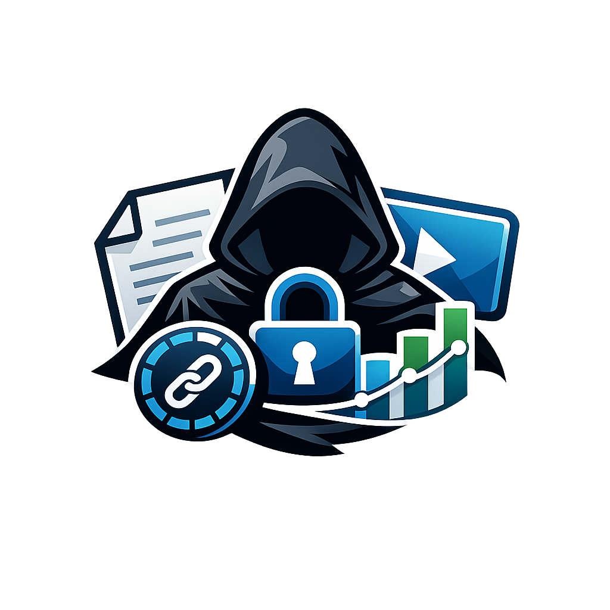

<p align="center">
  
</p>

<h3 align="center">Secure any document or video. One API call.</h3>

<p align="center">
  Open-source API for tokenized links with dynamic watermarks, real-time analytics, and viewer tracking.<br/>
  PDF · Video · DOCX · PPTX · XLSX — self-hostable, MIT licensed.
</p>

<p align="center">
  <a href="https://cloakshare.dev">Website</a> ·
  <a href="https://docs.cloakshare.dev">Docs</a> ·
  <a href="https://cloakshare.dev/pricing">Pricing</a> ·
  <a href="https://discord.gg/cloakshare">Discord</a> ·
  <a href="https://cloakshare.dev/blog">Blog</a>
</p>

<p align="center">
  <a href="https://github.com/cloakshare/cloakshare/stargazers"></a>
  <a href="https://github.com/cloakshare/cloakshare/blob/main/LICENSE"></a>
  <a href="https://github.com/cloakshare/cloakshare/actions"></a>
  <a href="https://img.shields.io/badge/PRs-welcome-brightgreen"></a>
</p>

<p align="center">
  
</p>

---

## What is CloakShare?

CloakShare is an open-source API for secure document and video sharing. Upload a file, get a tokenized link with dynamic watermarks, email gates, expiry, and real-time analytics. Know exactly who viewed your content, which pages they read, and which video segments they watched.

**Built for developers.** One API call. SDKs in three languages. Webhooks for everything. Self-host with Docker or use our cloud.

---

## Quick Start

### Cloud (fastest)

```bash
# Secure a document
curl -X POST https://api.cloakshare.dev/v1/links \
  -H "Authorization: Bearer cs_live_xxx" \
  -F file=@pitch-deck.pdf \
  -F require_email=true \
  -F watermark=true

# Response:
# {
#   "data": {
#     "id": "lnk_xK9mP2",
#     "secure_url": "https://view.cloakshare.dev/s/xK9mP2",
#     "page_count": 12,
#     "status": "active"
#   }
# }
```

Get your free API key at [cloakshare.dev](https://cloakshare.dev).

### Self-Hosted

```bash
git clone https://github.com/cloakshare/cloakshare.git
cd cloakshare
cp .env.example .env
docker compose up
```

Open `http://localhost:3000` — that's it. Full docs: [Self-hosting guide](https://docs.cloakshare.dev/self-hosting)

---

## Video Sharing (Flagship Feature)

Secure video sharing with HLS adaptive streaming, dynamic watermarks on every frame, and engagement heatmaps showing exactly which segments viewers watched, skipped, or rewatched.

```typescript
const link = await cloakshare.links.create({
  file: './product-demo.mp4',
  watermark: true,
  requireEmail: true,
});

// Viewer sees: email gate → HLS player with watermark overlay
// You see: who watched, completion %, segment-by-segment heatmap
```

**Supported formats:** MP4, MOV, WebM — delivered via HLS with adaptive bitrate.

No other open-source platform offers secure video sharing with engagement heatmaps.

---

## Features

### Core

| Feature | Description |
|---------|-------------|
| **Tokenized links** | Every link is a unique, non-guessable token |
| **Dynamic watermarks** | Viewer's email + date + session ID on every page/frame |
| **Email gate** | Require email before viewing |
| **Password protection** | Optional password on any link |
| **Link expiry** | Time-based and view-count-based |
| **Domain allowlist** | Restrict viewing to specific email domains |
| **Page-by-page analytics** | Time spent per page, completion rate |
| **Video engagement heatmaps** | Segment-level watch/skip/rewatch data |
| **Webhooks** | 8 events with HMAC-SHA256 signed payloads |
| **Office docs** | DOCX, PPTX, XLSX auto-convert to secure viewer |
| **Teams & RBAC** | Organizations with Owner/Admin/Member/Viewer roles |
| **Audit log** | Every action tracked with configurable retention |
| **Custom domains** | `docs.yourcompany.com` with CNAME verification |
| **Embedded viewer** | iframe embed with PostMessage API |
| **Real-time notifications** | SSE push when links are viewed |
| **Self-hostable** | MIT licensed, Docker, any S3-compatible storage |

### Supported File Types

```
Documents:  PDF · DOCX · PPTX · XLSX · ODP · ODS · ODT · CSV
Video:      MP4 · MOV · WebM
Images:     PNG · JPG · WebP
```

One API, every format. CloakShare detects the file type and handles conversion automatically.

---

## Plan Comparison

| Feature | Free | Starter $29/mo | Growth $99/mo | Scale $299/mo |
|---------|:----:|:--------------:|:-------------:|:-------------:|
| Secure links | 50/mo | 500/mo | 2,500/mo | 10,000/mo |
| Views | 500/mo | 10,000/mo | 25,000/mo | 100,000/mo |
| Max expiry | 7 days | 90 days | 1 year | Unlimited |
| Email gate | ✅ | ✅ | ✅ | ✅ |
| Dynamic watermarks | ✅ | ✅ | ✅ | ✅ |
| Office docs (DOCX, PPTX) | — | ✅ | ✅ | ✅ |
| Video sharing (MP4, MOV) | — | — | ✅ | ✅ |
| Password protection | — | ✅ | ✅ | ✅ |
| Webhooks | — | ✅ | ✅ | ✅ |
| Page analytics | — | ✅ | ✅ | ✅ |
| Brand removal | — | ✅ | ✅ | ✅ |
| Custom domains | — | — | ✅ | ✅ |
| Custom branding | — | — | ✅ | ✅ |
| Embedded viewer | — | — | — | ✅ |
| Teams | — | 2 seats | 5 seats | 15 seats |
| Audit log | — | — | 90 days | 1 year |
| SSO/SAML | — | — | — | ✅ |
| Self-hosted | ✅ | ✅ | ✅ | ✅ |

Annual billing: 20% off. [See full pricing](https://cloakshare.dev/pricing)

---

## SDKs

```bash
npm install @cloakshare/sdk                  # Node.js / TypeScript
pip install cloakshare                        # Python
go get github.com/cloakshare/cloakshare-go   # Go
```

### Node.js

```typescript
import CloakShare from '@cloakshare/sdk';

const cloak = new CloakShare('cs_live_xxx');

// Secure a document
const link = await cloak.links.create({
  file: './proposal.pdf',
  requireEmail: true,
  watermark: true,
  expiresIn: '7d',
});

console.log(link.secureUrl);
// → https://view.cloakshare.dev/s/xK9mP2

// Check analytics
const analytics = await cloak.links.getAnalytics(link.id);
console.log(analytics.viewers);
// → [{ email: "investor@acme.com", duration: 142, completion: 0.83 }]
```

### Python

```python
import cloakshare

client = cloakshare.Client("cs_live_xxx")

link = client.links.create(
    file="./proposal.pdf",
    require_email=True,
    watermark=True,
    expires_in="7d",
)

print(link.secure_url)
# → https://view.cloakshare.dev/s/xK9mP2
```

### Go

```go
client := cloakshare.NewClient("cs_live_xxx")

link, _ := client.Links.Create(&cloakshare.LinkParams{
    File:         "./proposal.pdf",
    RequireEmail: true,
    Watermark:    true,
    ExpiresIn:    "7d",
})

fmt.Println(link.SecureURL)
// → https://view.cloakshare.dev/s/xK9mP2
```

---

## API at a Glance

```
POST   /v1/links                    Create a secure link
POST   /v1/links/upload-url         Get presigned upload URL (large files)
POST   /v1/links/bulk               Create multiple links at once
GET    /v1/links                    List your links
GET    /v1/links/:id                Get link details
GET    /v1/links/:id/analytics      View analytics + engagement data
DELETE /v1/links/:id                Revoke a link

POST   /v1/webhooks                 Create a webhook endpoint
GET    /v1/webhooks                 List webhooks
DELETE /v1/webhooks/:id             Delete a webhook

GET    /v1/notifications/stream     SSE real-time view notifications

GET    /v1/viewer/:token            Get viewer metadata
POST   /v1/viewer/:token/verify     Verify email/password to view
POST   /v1/viewer/:token/track      Track viewing engagement

DELETE /v1/viewers/:email           GDPR data deletion
```

Full API reference: [API Docs](https://docs.cloakshare.dev)

---

## How It Works

```
You                         CloakShare                      Viewer
 │                              │                              │
 │  POST /v1/links              │                              │
 │  + file + rules ──────────►  │                              │
 │                              │  Render / transcode          │
 │  ◄──── secure_url ────────── │                              │
 │                              │                              │
 │  Share the link ─────────────────────────────────────────►  │
 │                              │                              │
 │                              │  ◄──── enters email ──────── │
 │                              │  ──── watermarked viewer ──► │
 │                              │  ◄──── tracking pings ─────  │
 │                              │                              │
 │  ◄──── webhook: link.viewed  │                              │
 │  GET /v1/links/:id/analytics │                              │
 │  ◄──── who, pages, time ──── │                              │
```

---

## Comparison

|  | CloakShare | DocSend | Papermark | Digify |
|--|:----------:|:-------:|:---------:|:------:|
| API-first | ✅ | ❌ | Partial | ❌ |
| Video + heatmaps | ✅ | ❌ | ❌ | ❌ |
| Dynamic watermarks | ✅ | Advanced only | Business+ | ✅ |
| Webhooks + HMAC | ✅ | ✅ | ✅ | ✅ |
| Self-hostable | ✅ | ❌ | ✅ | ❌ |
| Open source | ✅ MIT | ❌ | ✅ AGPL | ❌ |
| SDKs | 3 | 0 | 0 | 0 |
| Teams + RBAC | ✅ | ✅ | ✅ | ✅ |
| Starting price | Free | ~$15/user/mo | Free | ~$190/user/mo |

---

## Self-Hosting

CloakShare runs anywhere Docker runs. The self-hosted version includes PDF rendering, email gate, watermarks, webhooks, analytics, and the full viewer.

**Requirements:** Docker, 1GB RAM, S3-compatible storage (MinIO included).

**Works with:** MinIO · AWS S3 · Backblaze B2 · Cloudflare R2 · any S3-compatible provider.

```yaml
# docker-compose.yml (included in repo)
services:
  cloakshare:
    image: ghcr.io/cloakshare/cloakshare:latest
    ports:
      - "3000:3000"
    environment:
      - DATABASE_URL=file:./data/cloakshare.db
      - S3_ENDPOINT=http://minio:9000
    volumes:
      - ./data:/app/data
    depends_on:
      - minio

  minio:
    image: minio/minio
    command: server /data
    ports:
      - "9000:9000"
```

**Note:** Video transcoding requires FFmpeg. Set `ENABLE_VIDEO=true` to enable. Self-hosted supports all document and video types.

Full guide: [Self-Hosting Guide](https://docs.cloakshare.dev/self-hosting)

---

## Tech Stack

- **Runtime:** Node.js + [Hono](https://hono.dev) (ultrafast web framework)
- **Database:** SQLite via [Turso](https://turso.tech) (cloud) / local SQLite (self-hosted)
- **ORM:** [Drizzle](https://orm.drizzle.team)
- **Storage:** Cloudflare R2 / any S3-compatible
- **Video:** FFmpeg HLS transcoding (adaptive bitrate)
- **PDF Rendering:** Poppler (`pdftoppm`) + Sharp
- **Office Conversion:** LibreOffice headless
- **Viewer:** Canvas-based rendering (no downloadable files)
- **Marketing Site:** [Astro](https://astro.build)
- **Monorepo:** pnpm workspaces + [Turborepo](https://turbo.build)

---

## Project Structure

```
cloakshare/
├── apps/
│   ├── api/          # Hono API server
│   ├── site/         # Astro marketing site
│   ├── web/          # React dashboard SPA
│   └── viewer/       # Secure document/video viewer
├── packages/
│   └── shared/       # Shared types, utils, config
├── docker-compose.yml
├── .env.example
└── turbo.json
```

---

## Contributing

We welcome contributions! See [CONTRIBUTING.md](CONTRIBUTING.md) for guidelines.

```bash
# Development setup
git clone https://github.com/cloakshare/cloakshare.git
cd cloakshare
pnpm install
cp apps/api/.env.example apps/api/.env
pnpm dev
```

Good first issues are labeled [`good first issue`](https://github.com/cloakshare/cloakshare/labels/good%20first%20issue).

---

## License

[MIT](LICENSE) — use it however you want.

---

<p align="center">
  <a href="https://cloakshare.dev">Website</a> ·
  <a href="https://docs.cloakshare.dev">Docs</a> ·
  <a href="https://cloakshare.dev/pricing">Pricing</a> ·
  <a href="https://twitter.com/cloakshare">Twitter</a> ·
  <a href="https://discord.gg/cloakshare">Discord</a>
</p>

<p align="center">
  <sub>Built with love by the CloakShare team. If CloakShare helps you, consider <a href="https://github.com/cloakshare/cloakshare">giving us a star</a></sub>
</p>
